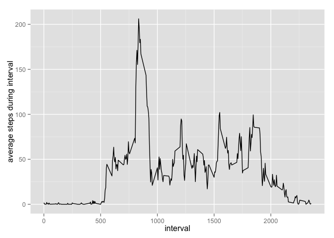

# Reproducible Research: Peer Assessment 1


### Loading and preprocessing the data

```r
library(ggplot2)

#setwd("RDokumente/RepData_PeerAssessment1")
#read in data and get a first overview
activity<-read.csv("activity.csv")
head(activity)
summary(activity)
str(activity)

#recalculate date as date
activity$date<-as.Date(activity$date)

#aggregate steps per interval for average daily activity pattern
stepsPerInterval<-aggregate(steps~interval,data=activity,FUN=mean)
summary(stepsPerInterval)

#aggregate steps per interval for total number of steps taken
stepsPerDay<-aggregate(steps~date,data=activity,FUN=sum)
```

### What is mean total number of steps taken per day?


```r
#Make a histogram of the total number of steps taken each day
plot1<-ggplot(stepsPerDay, aes(x=steps))+geom_histogram(binwidth=100,fill="cornsilk",color="black")
#set the axis labels
plot1+xlab("steps per day")+ylab("no. of days")
```

 

```r
#Calculate and report the mean and median total number of steps taken per day
meanSteps<-mean(stepsPerDay$steps)
medianSteps<-median(stepsPerDay$steps)
```

The mean of total number of steps taken per day is 1.0766189\times 10^{4}; the median is 10765.

### What is the average daily activity pattern?


```r
# Make a time series plot (i.e. type = "l") of the 5-minute interval (x-axis) and the average number of steps taken, averaged across all days (y-axis)
plot2<-ggplot(stepsPerInterval, aes(x=interval,y=steps))+geom_line()
plot2+ylab("average steps during interval")
```

 

```r
# Which 5-minute interval, on average across all the days in the dataset, contains the maximum number of steps?
maxInterval<-stepsPerInterval$interval[which.max(stepsPerInterval$steps)]
maxSteps<-stepsPerInterval$steps[which.max(stepsPerInterval$steps)]
```

The 5-minute interval 835 contains 206.1698113 steps on average across all the days in the dataset, which is the maximum number of steps.            

### Imputing missing values


### Are there differences in activity patterns between weekdays and weekends?
