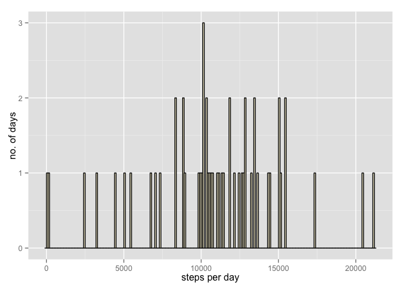

# Reproducible Research: Peer Assessment 1


## Loading and preprocessing the data

```r
library(ggplot2)

#setwd("RDokumente/RepData_PeerAssessment1")
activity<-read.csv("activity.csv")
head(activity)
summary(activity)
str(activity)
activity$date<-as.Date(activity$date)
stepsPerDay<-aggregate(steps~date,data=activity,FUN=sum)
summary(stepsPerDay)
```

## What is mean total number of steps taken per day?


```r
#Make a histogram of the total number of steps taken each day
plot1<-ggplot(stepsPerDay, aes(x=steps))+geom_histogram(binwidth=100,fill="cornsilk",color="black")
#set the axis labels
plot1+xlab("steps per day")+ylab("no. of days")
```

 

```r
#Calculate and report the mean and median total number of steps taken per day
meanSteps<-mean(stepsPerDay$steps)
medianSteps<-median(stepsPerDay$steps)
```

The mean of total number of steps taken per day is 1.0766189\times 10^{4}; the median is 10765.

## What is the average daily activity pattern?


```r
## Imputing missing values


## Are there differences in activity patterns between weekdays and weekends?
```
