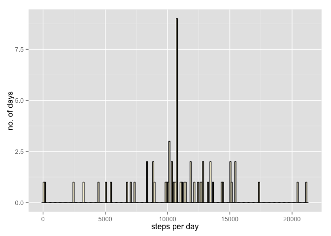

# Reproducible Research: Peer Assessment 1


### Loading and preprocessing the data

```r
library(ggplot2)

#setwd("RDokumente/RepData_PeerAssessment1")
#read in data and get a first overview
activity<-read.csv("activity.csv")
head(activity)
summary(activity)
str(activity)

#recalculate date as date
activity$date<-as.Date(activity$date)

#aggregate steps per interval for average daily activity pattern
stepsPerInterval<-aggregate(steps~interval,data=activity,FUN=mean)
summary(stepsPerInterval)

#aggregate steps per interval for total number of steps taken
stepsPerDay<-aggregate(steps~date,data=activity,FUN=sum)
```

### What is mean total number of steps taken per day?


```r
#Make a histogram of the total number of steps taken each day
plot1<-ggplot(stepsPerDay, aes(x=steps))+geom_histogram(binwidth=100,fill="cornsilk",color="black")
#set the axis labels
plot1+xlab("steps per day")+ylab("no. of days")
```

 

```r
#Calculate and report the mean and median total number of steps taken per day
meanSteps<-mean(stepsPerDay$steps)
medianSteps<-median(stepsPerDay$steps)
```

The mean of total number of steps taken per day is 1.0766189\times 10^{4}; the median is 10765.

### What is the average daily activity pattern?


```r
# Make a time series plot (i.e. type = "l") of the 5-minute interval (x-axis) and the average number of steps taken, averaged across all days (y-axis)
plot2<-ggplot(stepsPerInterval, aes(x=interval,y=steps))+geom_line()
plot2+ylab("average steps during interval")
```

 

```r
# Which 5-minute interval, on average across all the days in the dataset, contains the maximum number of steps?
maxInterval<-stepsPerInterval$interval[which.max(stepsPerInterval$steps)]
maxSteps<-stepsPerInterval$steps[which.max(stepsPerInterval$steps)]
```

The 5-minute interval 835 contains 206.1698113 steps on average across all the days in the dataset, which is the maximum number of steps.            

### Imputing missing values


```r
# Calculate and report the total number of missing values in the dataset (i.e. the total number of rows with NAs)
sumNAs<-sum(is.na(activity))

# Devise a strategy for filling in all of the missing values in the dataset. The strategy does not need to be sophisticated. For example, you could use the mean/median for that day, or the mean for that 5-minute interval, etc.

# the averages of the intervals calculated for the previous question do replace the missing values 
activityMV <- merge(activity, stepsPerInterval, by = "interval")
mv <- is.na(activityMV$steps.x)
activityMV$steps.x[mv] <- activityMV$steps.y[mv]

#Create a new dataset that is equal to the original dataset but with the missing data filled in.
activityMV <- activityMV[, c(1:3)]

#Make a histogram of the total number of steps taken each day and Calculate and report the mean and median total number of steps taken per day. Do these values differ from the estimates from the first part of the assignment? What is the impact of imputing missing data on the estimates of the total daily number of steps?
stepsPerDayMV<-aggregate(steps.x~date,data=activityMV,FUN=sum)
plot3<-ggplot(stepsPerDayMV, aes(x=steps.x))+geom_histogram(binwidth=100,fill="cornsilk",color="black")
#set the axis labels
plot3+xlab("steps per day")+ylab("no. of days")
```

 

```r
#Calculate and report the mean and median total number of steps taken per day
meanStepsMV<-mean(stepsPerDayMV$steps.x)
medianStepsMV<-median(stepsPerDayMV$steps.x)

meanDiff<-meanStepsMV-meanSteps
medianDiff<-medianStepsMV-medianSteps
```

There are 2304 missing values in the dataset.

The mean of total number of steps taken per day is 1.0766189\times 10^{4} (1.0766189\times 10^{4} with missing values); the median is 1.0766189\times 10^{4} (10765 with missing values).

The impact of imputing missing data on the estimates of the total daily number of steps is 0 for the mean and 1.1886792 for the median.

### Are there differences in activity patterns between weekdays and weekends?
