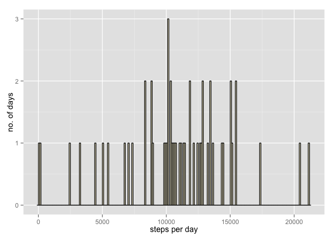
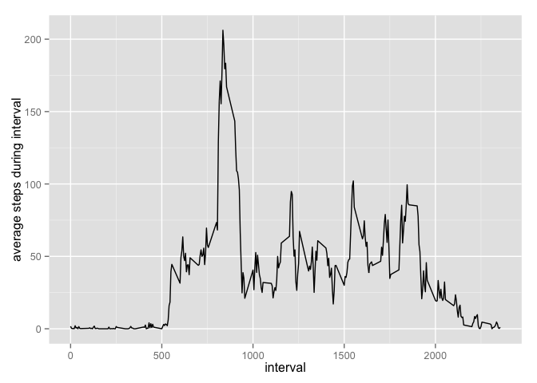
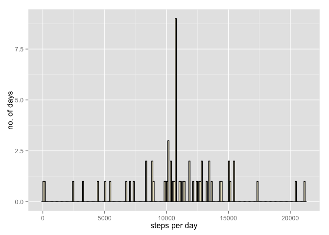
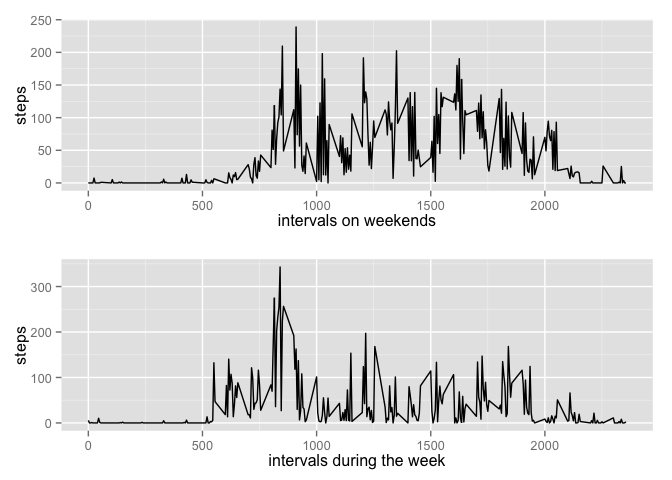

# Reproducible Research: Peer Assessment 1


### Loading and preprocessing the data
####read in data and get a first overview

```r
library(ggplot2)
library(grid)

#setwd("RDokumente/RepData_PeerAssessment1")

activity<-read.csv("activity.csv")
head(activity)
summary(activity)
str(activity)
```
####recalculate date as date

```r
activity$date<-as.Date(activity$date)
```

####aggregate steps per interval for average daily activity pattern

```r
stepsPerInterval<-aggregate(steps~interval,data=activity,FUN=mean)
summary(stepsPerInterval)
```

####aggregate steps per interval for total number of steps taken

```r
stepsPerDay<-aggregate(steps~date,data=activity,FUN=sum)
```

### What is mean total number of steps taken per day?
#####Make a histogram of the total number of steps taken each day

```r
plot1<-ggplot(stepsPerDay, aes(x=steps))+geom_histogram(binwidth=100,fill="cornsilk",color="black")
plot1+xlab("steps per day")+ylab("no. of days")
```

 

####Calculate and report the mean and median total number of steps taken per day

```r
meanSteps<-mean(stepsPerDay$steps)
medianSteps<-median(stepsPerDay$steps)
```

The mean of total number of steps taken per day is 1.0766189\times 10^{4}; the median is 10765.

### What is the average daily activity pattern?
#### Make a time series plot of the 5-minute interval (x-axis) and the average number of steps taken, averaged across all days (y-axis)


```r
plot2<-ggplot(stepsPerInterval, aes(x=interval,y=steps))+geom_line()
plot2+ylab("average steps during interval")
```

 

#### Which 5-minute interval, on average across all the days in the dataset, contains the maximum number of steps?

```r
maxInterval<-stepsPerInterval$interval[which.max(stepsPerInterval$steps)]
maxSteps<-stepsPerInterval$steps[which.max(stepsPerInterval$steps)]
```

The 5-minute interval 835 contains 206.1698113 steps on average across all the days in the dataset, which is the maximum number of steps.            

### Imputing missing values
#### Calculate and report the total number of missing values in the dataset (i.e. the total number of rows with NAs)

```r
sumNAs<-sum(is.na(activity))
```

There are 2304 missing values in the dataset.

#### Devise a strategy for filling in all of the missing values in the dataset. The strategy does not need to be sophisticated. For example, you could use the mean/median for that day, or the mean for that 5-minute interval, etc.

Solution: The averages of the intervals calculated for the previous question do replace the missing values 

```r
activityMV <- merge(activity, stepsPerInterval, by = "interval")
mv <- is.na(activityMV$steps.x)
activityMV$steps.x[mv] <- activityMV$steps.y[mv]
```

####Create a new dataset that is equal to the original dataset but with the missing data filled in.

```r
activityMV <- activityMV[, c(1:3)]
```
####Make a histogram of the total number of steps taken each day and Calculate and report the mean and median total number of steps taken per day. Do these values differ from the estimates from the first part of the assignment? What is the impact of imputing missing data on the estimates of the total daily number of steps?

```r
stepsPerDayMV<-aggregate(steps.x~date,data=activityMV,FUN=sum)
plot3<-ggplot(stepsPerDayMV, aes(x=steps.x))+geom_histogram(binwidth=100,fill="cornsilk",color="black")

plot3+xlab("steps per day")+ylab("no. of days")
```

 
####Calculate and report the mean and median total number of steps taken per day

```r
meanStepsMV<-mean(stepsPerDayMV$steps.x)
medianStepsMV<-median(stepsPerDayMV$steps.x)

meanDiff<-meanStepsMV-meanSteps
medianDiff<-medianStepsMV-medianSteps
```


The mean of total number of steps taken per day is 1.0766189\times 10^{4} (1.0766189\times 10^{4} with missing values); the median is 1.0766189\times 10^{4} (10765 with missing values).

The impact of imputing missing data on the estimates of the total daily number of steps is 0 steps for the mean and 1.1886792 steps for the median.

### Are there differences in activity patterns between weekdays and weekends?
####Create a new factor variable in the dataset with two levels – “weekday” and “weekend” indicating whether a given date is a weekday or weekend day.

```r
activity$weekday<-weekdays(activity$date)
weekend<-c("Samstag","Sonntag")
weekdays<-c("Montag","Dienstag","Mittwoch","Donnerstag","Freitag")
activityWeekend<-activity[which(activity$weekday==weekend),]
activityWeekday<-activity[which(activity$weekday==weekdays),]
```

```
## Warning in activity$weekday == weekdays: Länge des längeren Objektes
##  	 ist kein Vielfaches der Länge des kürzeren Objektes
```

#####Make a panel plot containing a time series plot (i.e. type = "l") of the 5-minute interval (x-axis) and the average number of steps taken, averaged across all weekday days or weekend days (y-axis). See the README file in the GitHub repository to see an example of what this plot should look like using simulated data.


```r
#aggregate steps per interval for average daily activity pattern
stepsPerIntervalWeekend<-aggregate(steps~interval,data=activityWeekend,FUN=mean)
stepsPerIntervalWeekday<-aggregate(steps~interval,data=activityWeekday,FUN=mean)


plotWeekend<-ggplot(stepsPerIntervalWeekend,aes(x=interval,y=steps))+geom_line()+xlab("intervals on weekends")
plotWeekday<-ggplot(stepsPerIntervalWeekday,aes(x=interval,y=steps))+geom_line()+xlab("intervals during the week")

# Multiple plot function 
#######################################################################################
#derived from: http://www.cookbook-r.com/Graphs/Multiple_graphs_on_one_page_(ggplot2)/#
#######################################################################################
# ggplot objects can be passed in ..., or to plotlist (as a list of ggplot objects)
# - cols:   Number of columns in layout
# - layout: A matrix specifying the layout. If present, 'cols' is ignored.
#
# If the layout is something like matrix(c(1,2,3,3), nrow=2, byrow=TRUE),
# then plot 1 will go in the upper left, 2 will go in the upper right, and
# 3 will go all the way across the bottom.
#
multiplot <- function(..., plotlist=NULL, file, cols=1, layout=NULL) {
  require(grid)
  
  # Make a list from the ... arguments and plotlist
  plots <- c(list(...), plotlist)
  
  numPlots = length(plots)
  
  # If layout is NULL, then use 'cols' to determine layout
  if (is.null(layout)) {
    # Make the panel
    # ncol: Number of columns of plots
    # nrow: Number of rows needed, calculated from # of cols
    layout <- matrix(seq(1, cols * ceiling(numPlots/cols)),
                     ncol = cols, nrow = ceiling(numPlots/cols))
  }
  
  if (numPlots==1) {
    print(plots[[1]])
    
  } else {
    # Set up the page
    grid.newpage()
    pushViewport(viewport(layout = grid.layout(nrow(layout), ncol(layout))))
    
    # Make each plot, in the correct location
    for (i in 1:numPlots) {
      # Get the i,j matrix positions of the regions that contain this subplot
      matchidx <- as.data.frame(which(layout == i, arr.ind = TRUE))
      
      print(plots[[i]], vp = viewport(layout.pos.row = matchidx$row,
                                      layout.pos.col = matchidx$col))
    }
  }
}
###########################################################################################################


multiplot(plotWeekend,plotWeekday, cols=1)
```

 

